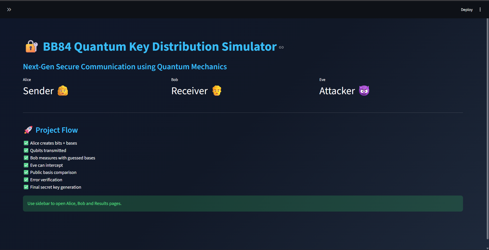
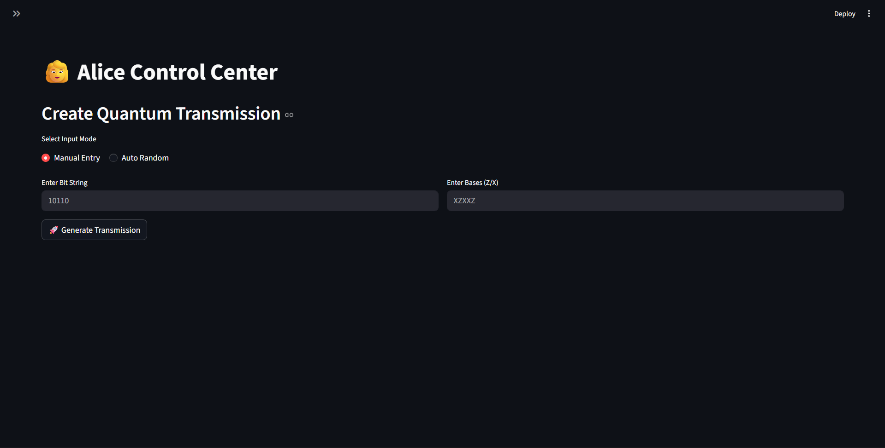
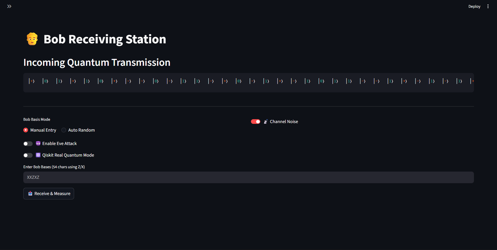
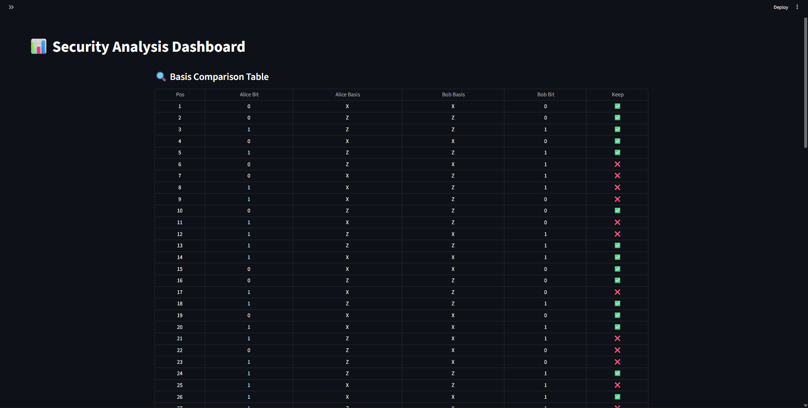
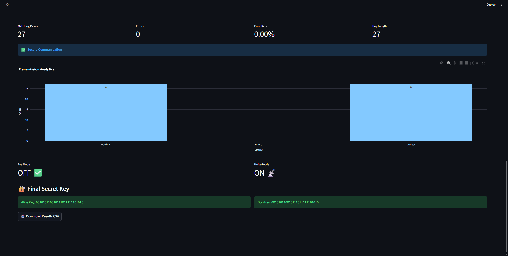

# BB84 Quantum Key Distribution Simulator

An interactive, resume-grade simulation of the **BB84 Quantum Cryptography Protocol** built using Python, Streamlit, Plotly, and Qiskit.

This project demonstrates how two communicating parties (**Alice** and **Bob**) establish a secure shared secret key using principles of quantum mechanics while detecting an eavesdropper (**Eve**).

---

# Project Highlights

- Interactive Web Interface
- Alice / Bob Communication Workflow
- Manual and Auto Random Modes
- Eve Attack Simulation
- Channel Noise Simulation
- Error Rate Detection
- Final Shared Secret Key Generation
- Analytics Dashboard
- CSV Export
- Optional Qiskit Quantum Backend

---

# Screenshots

## Home Page

## Alice's Interface

## Bob's Interface

## Results

